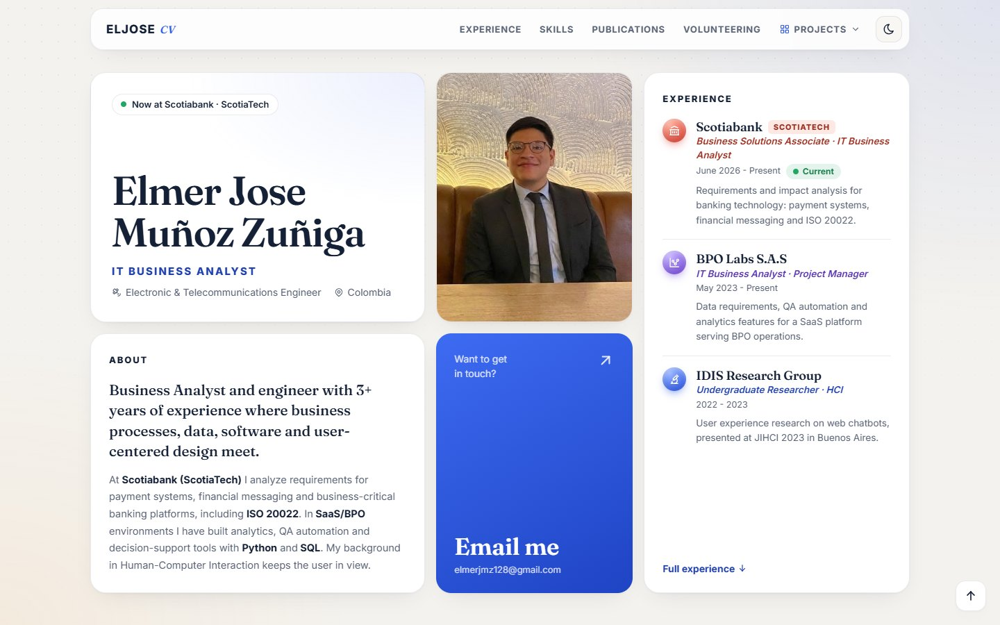
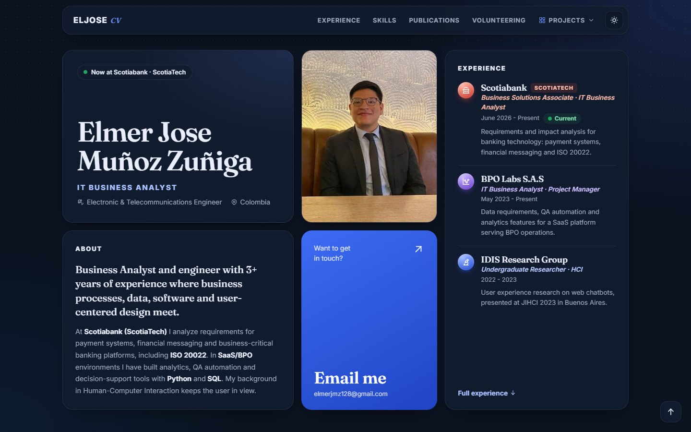
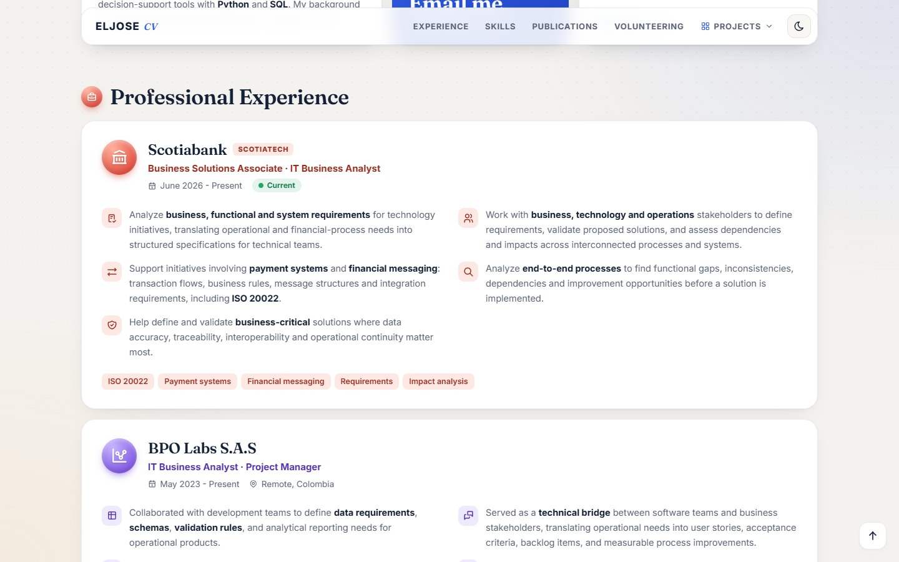
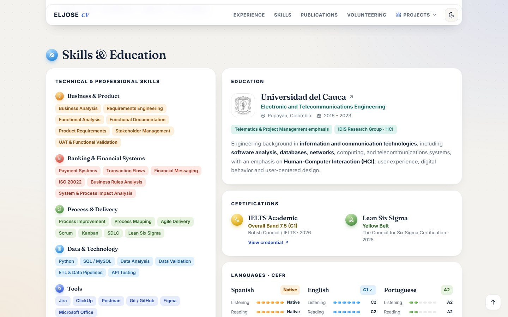
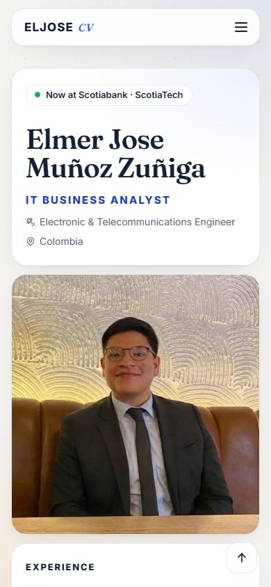
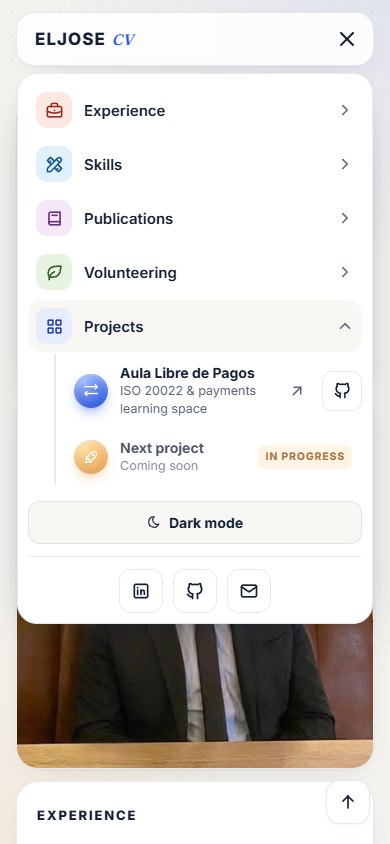
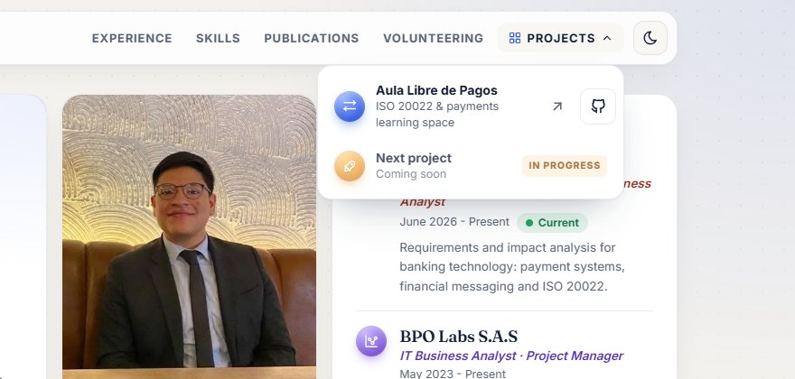

<div align="center">

<a href="https://ejmz216.github.io/eljose/"></a>

### IT Business Analyst · Banking, payments and data

[](https://ejmz216.github.io/eljose/)


-e3a800?style=flat-square&labelColor=142036)

[About](#-about) · [Experience](#-experience) · [A look inside](#-a-look-inside) · [Side projects](#-side-projects) · [Design](#-design-notes) · [Español](#-en-español) · [How it was made](#-how-this-was-made)

</div>

---

## 👋 About

I'm an **Electronic and Telecommunications Engineer** and **IT Business Analyst** with 3+ years where business processes, data, software and user-centered design meet. Today I work at **Scotiabank (ScotiaTech)** on payment systems, financial messaging and ISO 20022.

This repository is my CV, built as a small website instead of a PDF.

<table>
<tr>
<td width="33%" align="center"><br><b>Banking technology</b><br><sub>Requirements and impact analysis for payments and financial messaging.</sub></td>
<td width="33%" align="center"><br><b>Business ↔ Data</b><br><sub>Requirements, process analysis, Python and SQL.</sub></td>
<td width="33%" align="center"><br><b>Human-centered</b><br><sub>Human-Computer Interaction research, with two publications.</sub></td>
</tr>
</table>

## 💼 Experience

| | Where | Role | Focus |
|:--:|---|---|---|
| 🏦 | **Scotiabank** · ScotiaTech | Business Solutions Associate · IT Business Analyst |    |
| 📊 | **BPO Labs S.A.S** · Remote | IT Business Analyst · Project Manager |    |
| 🔬 | **IDIS Research Group** · Universidad del Cauca | Undergraduate Researcher · HCI |   |

> [!TIP]
> One number I'm proud of: report processing went from **more than 4 hours to under 30 minutes** after automating it with Python and SQL.

## 📸 A look inside

<table>
<tr>
<td width="50%"><br><sub><b>Light theme.</b> Name, photo, a short timeline, about and contact.</sub></td>
<td width="50%"><br><sub><b>Dark theme.</b> Deep navy. The choice is remembered.</sub></td>
</tr>
<tr>
<td width="50%"><br><sub><b>Experience.</b> One color per company; every highlight has an icon.</sub></td>
<td width="50%"><br><sub><b>Skills & education.</b> Five skill groups, certifications and CEFR meters.</sub></td>
</tr>
</table>

<details>
<summary>📱 <b>On a phone</b></summary>
<br>
<div align="center">

&nbsp;&nbsp;

</div>
</details>

## 🧩 Side projects

Side projects live in the **Projects** menu at the top of the site: the name opens the live site, the GitHub icon opens the code.

<div align="center"></div>

| | Project | What it is | Links |
|:--:|---|---|---|
|  | **Aula Libre de Pagos** | Free, interactive learning space for ISO 20022, payment systems and fast payments. | [Site](https://ejmz216.github.io/payment-lab/) · [Code](https://github.com/Ejmz216/payment-lab) |
| ⏳ | *Next project* | In progress. | — |

## 🎨 Design notes

Color with restraint: a warm, almost plain background, white cards in a bento grid, and **icons inside colored orbs instead of emojis**. Blue is the accent; every other color marks meaning and always comes with an icon or a label.

<details>
<summary>🎨 <b>Palette: one tone, one meaning</b></summary>
<br>

| Tone | Color | Means |
|---|---|---|
|  | `#2f5bea` | Accent, tools, research group |
|  | `#e0463a` | Scotiabank, banking and payments |
|  | `#7a4fe0` | BPO Labs |
|  | `#ec8a1f` | Business, requirements |
|  | `#1e88e5` | Data and technology |
|  | `#4b9443` | Process, delivery, volunteering |
|  | `#a356bd` | People, UX and publications |
|  | `#22918a` | Education |
|  | `#e3a800` | Languages |

</details>

<table>
<tr>
<td width="25%" align="center"><br><b>Type</b><br><sub>Fraunces for headings, Inter for reading.</sub></td>
<td width="25%" align="center"><br><b>Light & dark</b><br><sub>Follows the system, remembers your choice.</sub></td>
<td width="25%" align="center"><br><b>Calm motion</b><br><sub>Cards fade in once; off with <code>prefers-reduced-motion</code>.</sub></td>
<td width="25%" align="center"><br><b>Any screen</b><br><sub>The grid folds into one column on phones.</sub></td>
</tr>
</table>

<details>
<summary>🛠️ <b>Run it locally</b></summary>

```bash
npm install
npm start          # dev server
npm run build      # production build
npm run deploy     # publish to GitHub Pages
```

The whole site lives in two files: [`src/pages/App.jsx`](src/pages/App.jsx) holds the content as plain data arrays (a new job or project is one more item in a list), and [`src/pages/App.css`](src/pages/App.css) holds the tokens, tones and layout.

</details>

---

## 🌎 En español

<details>
<summary><b>Leer el resumen en español</b></summary>
<br>

Este repositorio es mi hoja de vida en forma de sitio web. Soy **Ingeniero en Electrónica y Telecomunicaciones** y **Analista de Negocio de TI**, con más de 3 años entre procesos de negocio, datos, software y diseño centrado en el usuario.

- **Ahora:** Business Solutions Associate en **Scotiabank (ScotiaTech)**, en sistemas de pago, mensajería financiera e ISO 20022.
- **Experiencia:** IT Business Analyst y Project Manager en **BPO Labs**, con analítica, automatización de QA y Python + SQL.
- **Formación:** Universidad del Cauca, con investigación en Interacción Humano-Computador y dos publicaciones.
- **Proyectos:** en el menú *Projects* del sitio, empezando por Aula Libre de Pagos.

👉 [Ver la hoja de vida en vivo](https://ejmz216.github.io/eljose/)

</details>

## 🤖 How this was made

I designed and built the first versions of this site myself: the structure, the content and the React code.

Later I used AI (**Claude**, by Anthropic) as a creative partner for this redesign: the bento layout, the color system, the icon orbs, the projects menu, adding my Scotiabank experience, cleaning up old code, and this README. All the content describes my real experience, and I reviewed every change before publishing it.

<sub>Icons: <a href="https://tabler.io/icons">Tabler Icons</a> (MIT) via <a href="https://react-icons.github.io/react-icons/">react-icons</a> · Fonts: <a href="https://fonts.google.com/specimen/Fraunces">Fraunces</a> and <a href="https://fonts.google.com/specimen/Inter">Inter</a> (SIL Open Font License) · University emblem: <a href="https://commons.wikimedia.org/wiki/File:Logo_de_la_Universidad_del_Cauca.svg">Universidad del Cauca, via Wikimedia Commons</a> (CC BY-SA 4.0), cropped.</sub>

<div align="center">
<br>
<sub><i>May the data be with you.</i></sub>
<br><br>
<a href="https://ejmz216.github.io/eljose/"><b>→ Open the live CV</b></a>
</div>
